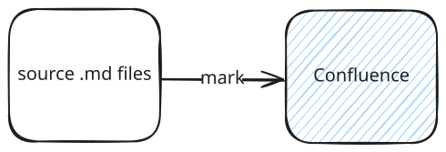

# Excalidraw

Don't want to deal with text-to-diagram and just wanna draw? It also support excalidraw! You need to use [Excalidraw by pomdtr for VS Code](https://marketplace.visualstudio.com/items?itemName=pomdtr.excalidraw-editor) or [Excalidraw Integration by Brice Dutheil for IntelliJ](https://plugins.jetbrains.com/plugin/17096-excalidraw-integration) though.

## Image link

With the extension, you can click the .excalidraw.svg file and edit it like as if it's a canvas. It will be rendered like usual image in both GitHub and Confluence.

