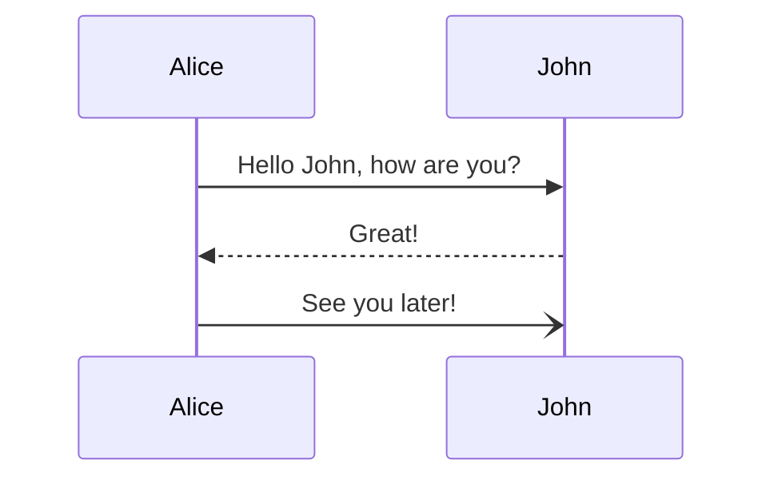
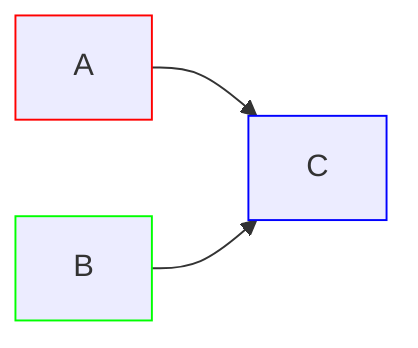
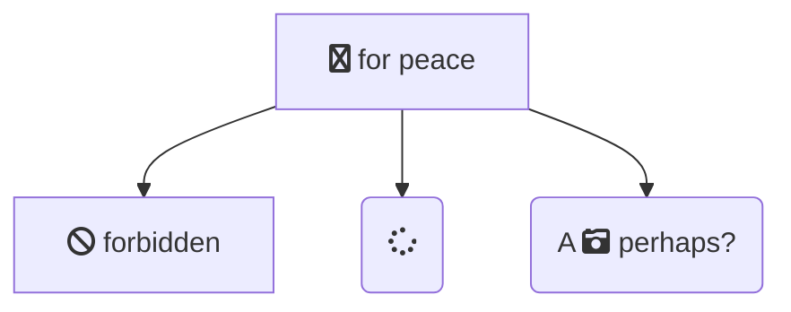

# Mermaid

Mermaid diagram are supported both in GitHub and in Confluence. For VS Code, I recommend [Markdown Preview Enhanced by Yiyi Wang](https://marketplace.visualstudio.com/items?itemName=shd101wyy.markdown-preview-enhanced).

## Inline

[Source](./diagram.mermaid).

## Image link

While this renders in editor (with extension), it does not supported by GitHub nor `mark`.

## Style

It's tricky. Some are supported by GitHub and `mark`...

Some are not supported by GitHub...

Some are not supported by `mark`.

Best to not use fancy styles lol.

## Fontawesome

Does not always works.

