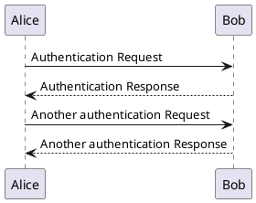
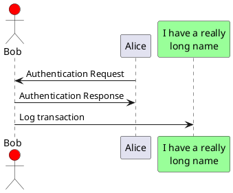
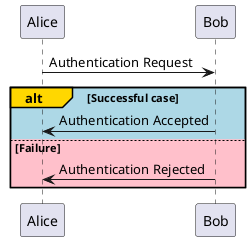
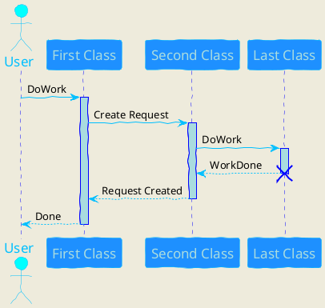

# PlantUML

Although PlantUML diagram is not natively supported by GitHub, it is also not supported by `mark`. None of these gonna render in Confluence. For VS Code, I recommend [Markdown Preview Enhanced by Yiyi Wang](https://marketplace.visualstudio.com/items?itemName=shd101wyy.markdown-preview-enhanced). You would also need to supply the jar/server.

## Inline

## Image link

While this renders in editor (with extension), it does not supported by GitHub nor `mark`.

[Source](./diagram.plantuml).

## Color

Can also do fancy features like changing colours.

Changing colours.

And changing colours.

_Yeah, that's it. What more feature do you need for your diagram?_
